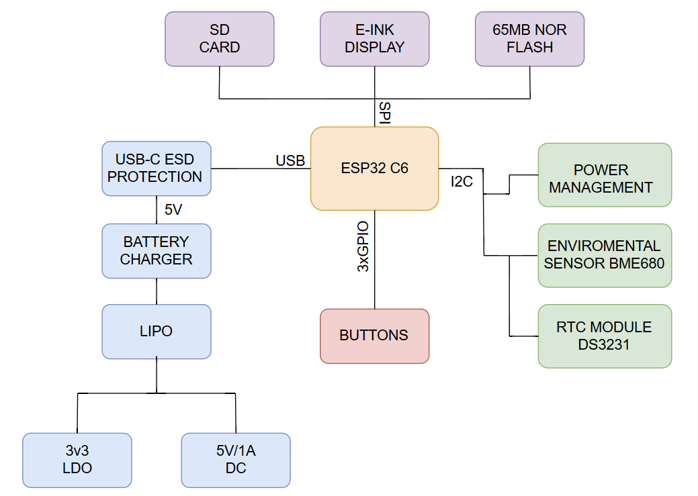

# OpenBook Reader

## Diagrama Bloc

## Bill Of Materials (BOM)

| Componenta | Link | Datasheet |
|-----------|--------------|-----------|
| CAPACITOR 0402 | [Model](https://componentsearchengine.com/part-view/CC0402MRX5R5BB106/YAGEO) | [Datasheet](https://componentsearchengine.com/Datasheets/2/CC0402MRX5R5BB106.pdf) |
| Capacitor 0805| [Model](https://ro.mouser.com/ProductDetail/KYOCERA-AVX/SD0805S020S1R0?qs=jCA%252BPfw4LHbpkAoSnwrdjw%3D%3D) | [Datasheet](https://ro.mouser.com/datasheet/2/40/schottky-3165252.pdf) |
| CPH3225A | [Model](https://www.snapeda.com/parts/CPH3225A/Seiko+Instruments/view-part/?ref=eda) | [Datasheet](https://www.snapeda.com/parts/CPH3225A/Seiko+Instruments/view-part/?ref=eda) |
| RCL CPOL 3528 | [Model](https://www.snapeda.com/parts/TAJB475K025RNJ/AVX/view-part/?ref=dk&t=capacitor%203528&con_ref=None) | [Datasheet](https://s3.amazonaws.com/snapeda/datasheet/TAJB475K025RNJ_AVX.pdf) |
| Resistor 0402 | [Model](https://componentsearchengine.com/part-view/R0402%201%25%20100%20K%20(RC0402FR-07100KL)/YAGEO) | [Datasheet](https://www.yageo.com/upload/media/product/products/datasheet/rchip/PYu-RC_Group_51_RoHS_L_12.pdf) |
| MBR0530 DIODE | [Model](https://eu.mouser.com/ProductDetail/KYOCERA-AVX/SD0805S020S1R0?qs=jCA%252BPfw4LHbpkAoSnwrdjw%3D%3D) | [Datasheet](https://ro.mouser.com/datasheet/2/40/schottky-3165252.pdf) |
| PGB1010603MR DIODE | [Model](https://www.snapeda.com/parts/PGB1010603MR/Littelfuse/view-part/?ref=eda) | [Datasheet](https://www.snapeda.com/parts/PGB1010603MR/Littelfuse%20Inc./datasheet/) |
| BUTTON | [Model](https://industry.panasonic.com/global/en/products/control/switch/light-touch/number/evqpuj02k) | [Datasheet](https://industry.panasonic.com/global/en/downloads?tab=catalog&small_g_cd=203&part_no=EVQPUJ02K) |
| LED 0603 | [Model](https://www.snapeda.com/parts/KP-1608SURCK/Kingbright/view-part/?ref=search&t=LED%200603) | [Datasheet](https://www.snapeda.com/parts/KP-1608SURCK/Kingbright/datasheet/) |
| BME680 Sensor | [Model](https://www.digikey.ro/en/models/7401317) | [Datasheet](https://www.bosch-sensortec.com/media/boschsensortec/downloads/datasheets/bst-bme680-ds001.pdf) |
| SJ | [Model](https://grabcad.com/library/solder-jumpers-1) | [Datasheet](https://grabcad.com/library/solder-jumpers-1) |
| ESP32C6 Varistor 1812 (PFMF) | [Model](https://ro.mouser.com/ProductDetail/EPCOS-TDK/B72520T0350K062?qs=dEfas%2FXlABIszF52uu7vrg%3D%3D) | [Datasheet](https://www.snapeda.com/parts/RC0603JR-070RL/Yageo/datasheet/) |
| FH34SRJ-24S-0.5SH (J1) | [Model](https://www.snapeda.com/parts/FH34SRJ-24S-0.5SH(99)/Hirose/view-part/) | [Datasheet](https://www.snapeda.com/parts/FH34SRJ-24S-0.5SH(99)/Hirose%20Connector/datasheet/) |
| USB4110-GF-A (J2) | [Model](https://componentsearchengine.com/part-view/USB4110-GF-A/GCT%20(GLOBAL%20CONNECTOR%20TECHNOLOGY)) | [Datasheet](https://gct.co/files/drawings/usb4110.pdf) |
| QWIIC Connector (J3) | [Model](https://www.snapeda.com/parts/PRT-14417/SparkFun/view-part/) | [Datasheet](https://www.snapeda.com/parts/PRT-14417/SparkFun%20Electronics/datasheet/) |
| 112A-TAAR-R03 (J4)| [Model](https://www.snapeda.com/parts/112A-TAAR-R03/Attend/view-part/) | [Datasheet](https://www.snapeda.com/parts/112A-TAAR-R03/Attend/datasheet/) |
| 744043680 (L1)| [Model](https://ro.mouser.com/ProductDetail/Wurth-Elektronik/744043680?qs=PGXP4M47uW6VkZq%252BkzjrHA%3D%3D) | [Datasheet](https://www.we-online.com/components/products/datasheet/744043680.pdf) |
| DMG2305UX-7 (Q1&Q2) | [Model](https://componentsearchengine.com/part-view/DMG2305UX-7/Diodes%20Incorporated) | [Datasheet](https://www.snapeda.com/parts/SI1308EDL-T1-GE3/Vishay%20Siliconix/datasheet/) |
| SI1308EDL-T1-GE3 (Q3) | [Model](https://componentsearchengine.com/part-view/SI1308EDL-T1-GE3/Vishay) | [Datasheet](https://www.snapeda.com/parts/SI1308EDL-T1-GE3/Vishay%20Siliconix/datasheet/) |
| W25Q512JVEIQ (U1) | [Model](https://www.snapeda.com/parts/W25Q512JVEIQ/Winbond+Electronics/view-part/?ref=eda) | [Datasheet](https://www.winbond.com/resource-files/W25Q512JV%20SPI%20RevB%2006252019%20KMS.pdf) |
| ESP32C6 WROOM-1-N8 (U2) | [Model](https://www.snapeda.com/parts/ESP32-C6-WROOM-1-N8/Espressif+Systems/view-part/?ref=eda) | [Datasheet](https://www.snapeda.com/parts/ESP32-C6-WROOM-1-N8/Espressif+Systems/view-part/?ref=eda) |
| DS3231SN (U3) | [Model](https://www.snapeda.com/parts/DS3231SN%23/Analog+Devices/view-part/?ref=eda) | [Datasheet](https://www.snapeda.com/parts/DS3231SN%23/Analog%20Devices/datasheet/) |
| MAX17048G+T10 (U4) | [Model](https://www.snapeda.com/parts/MAX17048G+T10/Analog+Devices/view-part/?ref=eda) | [Datasheet](https://www.snapeda.com/parts/MAX17048G+T10/Analog%20Devices/datasheet/) |
| MCP73831 Power Management (U5) | [Model](https://www.snapeda.com/parts/MCP73831T-2ACI/OT/Microchip/view-part/) | [Datasheet](https://www.snapeda.com/parts/MCP73831T-2ACI/OT/Microchip/datasheet/) |
| BD5229G-TR (IC1) | [Model](https://www.digikey.ee/en/models/658502) | [Datasheet](https://fscdn.rohm.com/en/products/databook/datasheet/ic/power/voltage_detector/bd52xxg-e.pdf) |
| XC6220A331MR-G (IC4) | [Model](https://componentsearchengine.com/part-view/XC6220A331MR-G/Torex) | [Datasheet](https://product.torexsemi.com/system/files/series/xc6220.pdf) |
